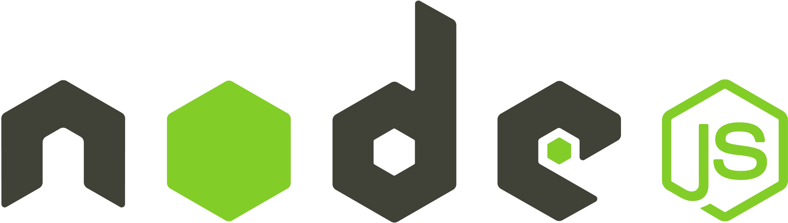

<h1 align="center">
  <a href="https://github.com/csorlandi/nodejs-concepts">
    
  </a>
</h1>

<h2 align="center">
  Stu[d]y/oc
</h2>

<p align="center">
  <a href="https://github.com/csorlandi">
    
  </a>

  
</p>

<p align="center">Esse é um projeto criado para documentar todos os  meus estudos estudos (Study Doc), para ter um registro da trajetória percorrida e ter um parâmetro para medir a evolução no decorrer to tempo.</p>

<p align="center">Os objetos de estudo desse repositório são os Principais Conceitos do NodeJS, uma plataforma Javascript que permite o desenvolvimento de aplicações para back-end.</p>

---

## 🔖 Índice

<ul>
  <li>
    <a href="#-introdução">Introdução</a>
    <ul>
      <li><a href="#-documentação">Documentação</a></li>
      <li><a href="#-feito-com">Feito Com</a></li>
    </ul>
  </li>
  <li>
    <a href="#-instalação">Instalação</a>
    <ul>
      <li><a href="#-requisitos">Requisitos</a></li>
      <li><a href="#-clone">Clone</a></li>
      <li><a href="#-setup">Setup</a></li>
    </ul>
  </li>
  <li><a href="#-contribuição">Contribuição</a></li>
  <li><a href="#-apoio">Apoio</a></li>
  <li><a href="#-licença">Licença</a></li>
</ul>

---

## 📌 Introdução

### 📖 Documentação

- Para acessar a Documentação basta acessar o link abaixo:

**[Documentação](documentation/README.md)**

### 🛠 Feito com

- [NodeJS](https://reactnative.dev/) - Node.js é uma plataforma construída sobre o motor JavaScript do Google Chrome para facilmente construir aplicações de rede rápidas e escaláveis.

---

## 🚀 Instalação

### 🧾 Requisitos

- Para rodar qualquer aplicação feita em Node você precisa configurar o Ambiente de Desenvolvimento na sua máquina;
- Para configurar o ambiente, basta [**acessar esse link**](https://nodejs.org/en/), baixar e instalar a versão LTS do Node.

### 👯‍♀️ Clone

- Clone esse repositório para sua máquina local:

```
https://github.com/csorlandi/nodejs-concepts
```

### 🎛 Setup

- Clone ou Baixe o projeto na sua máquina;

- Navegue até a pasta do projeto no terminal;

- Execute `yarn` ou `npm install`;

- Execute `node src/index.js`;

- Acesse `http://localhost:3333` no navegador.

---

## 🤔 Contribuição

> Para começar...

### Passo 1

- 🍴 Faça um Fork desse repositório!

### Passo 2

- 👯 Clone esse repositório para sua máquina local executando `git clone https://github.com/csorlandi/nodejs-concepts.git`

### Passo 3

- 🎋 Crie uma branch de feature executando `git checkout -b my-feature`

### Passo 4

- ✅ Faça commit com as suas mudanças executando `git commit -m 'feat: My new feature'`;

### Passo 5

- 📌 Faça o Push para da branch executando `git push origin my-feature`;

### Passo 6

- 🔃 Crie um novo Pull Request

Depois que for feito o merge do seu Pull Request, você pode deletar a branch de feature.

---

## 📌 Apoio

Entre em contato comigo em qualquer uma das minhas redes!

- Linktree em [/csorlandi](https://linktr.ee/csorlandi)

---

## 📝 Licença


Este projeto está licenciado sob a licença MIT - consulte o arquivo [LICENSE](LICENSE) para obter detalhes.

---

Feito com 💚 Aproveite!