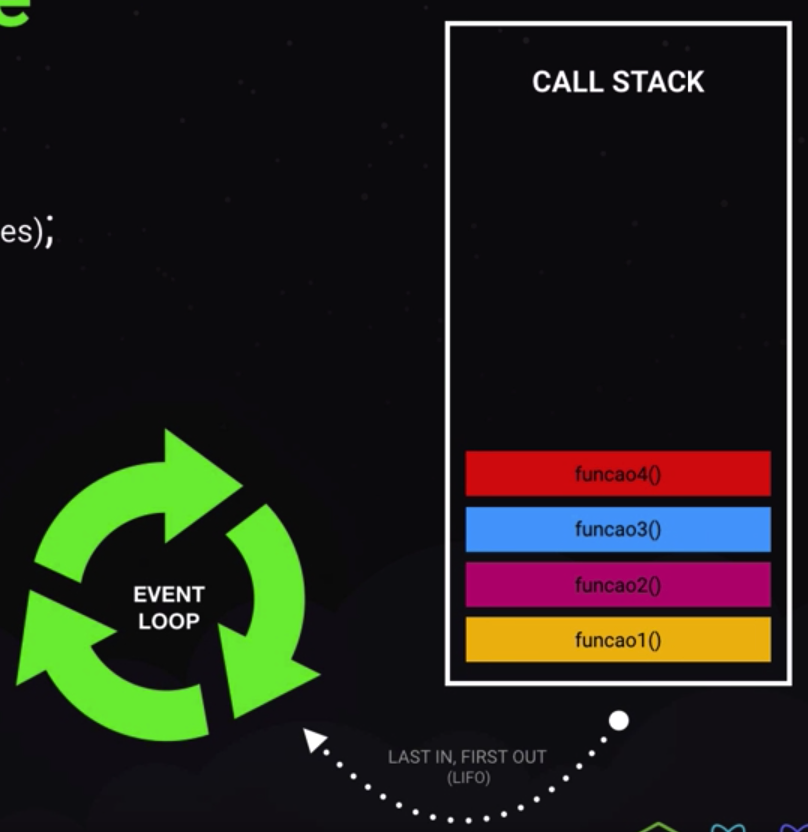
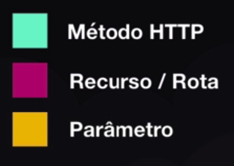
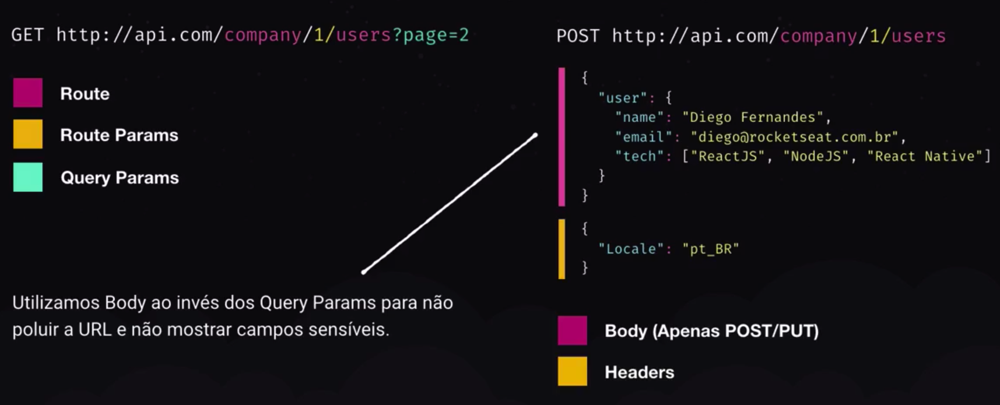

# Conceitos do Node

## O que é o Node.js?

- Javascript no back-end;
  - Não lidamos com eventos do usuário final;
  - Rotas e integrações;
- Plataforma (não linguagem);
- Construída em cima da V8;
- Comparável a PHP / Ruby / Python / Go;

## O que é o NPM?

- Instalar bibliotecas de terceiros;
- Fornecer bibiotecas;
- Por que utilizaremos o Yarn?
  - Ele está avançando mais rápido que o NPM em questão de funcionalidades;
- Comparáveis:
  - Composer do PHP;
  - Gems do Ruby;
  - PIP do Python;

## Características do Node

- Arquitetura Event-loop;
  - Baseada em eventos (Rotas na maioria das vezes);
  - Call Stack;
- Node single-thread;
- C++ por trás com libuv;
- Background threads;
- Non-blocking I/O;

<p align="center">
  
</p>

## Frameworks

- ExpressJS como base:
  - Sem opinião;
  - Ótimo para iniciar;
  - Micro-serviços;
- Frameworks opinados:
  - AdonisJS;
  - NestJS;

# Conceitos API REST

## Como funciona?

- Fluxo da requisição e resposta:
  - Requisição feira por um cliente;
  - Resposta retornada através de uma estrutura de dados;
  - Cliente recebe resposta e processa resultado;
  - As rotas utilizam métodos HTTP:
    - <span style="color: #75f3d0;">GET</span> http://minhaapi.com/<span style="color: #BB227B;">users</span>
    - <span style="color: #75f3d0;">POST</span> http://minhaapi.com/<span style="color: #BB227B;">users</span>
    - <span style="color: #75f3d0;">PUT</span> http://minhaapi.com/<span style="color: #BB227B;">users</span>/<span style="color: #EDBE00;">1</span>
    - <span style="color: #75f3d0;">DELETE</span> http://minhaapi.com/<span style="color: #BB227B;">users</span>/<span style="color: #EDBE00;">1</span>

<p align="center">
  
</p>

## Benefícios

- Múltiplos clientes (front-end), mesmo back-end;
- Protocolo de comunicação padronizado (JSON);
  - Mesma estrutura para web / mobile / API pública;
  - Comunicação com serviços externos;

## Conteúdo da requisição

<p align="center">
  
</p>

## HTTP Codes

- <span style="color: #5097C2;">1xx</span>: Informational
- <span style="color: #489C8E;">2xx: Success
  - 200: SUCCESS
  - 201: CREATED
- <span style="color: #AD4A81;">3xx</span>: Redirection
  - 301: MOVED PERMANENTLY
  - 302: MOVED
- <span style="color: #E4C547;">4xx</span>: Client Error
  - 400: BAD REQUEST
  - 401: UNAUTHORIZED
  - 404: NOT FOUND
- <span style="color: #EF6E64;">5xx</span>: Server Error
  - 500: INTERNAL SERVER ERROR

> 💡 BORA CODAR!

# Criando projeto Node

- Criar pasta para o projeto;
- Navegar até a pasta no terminal;
- Executar `yarn init -y` para iniciar o projeto;
  - O comando acima vai criar o `package.json` , um arquivo que guarda algumas informações sobre o projeto;
- Abrir o projeto no VS Code com `code .`;
  - Caso não tenha o comando `code .` reconhecido no terminal:
    - Abra uma janela do VS Code;
    - Aperte `Ctrl` + `Shift` + `P` (ou `Cmd` + `Shift` + `P` );
    - Pesquise e selecione a opção: `Install 'code' command in PATH` ;
- Crie uma pasta `src` dentro do projeto;
- Dentro da `src` crie um `index.js` ;
- No terminal execute `yarn add express` para instalar o Express;
- No arquivo `index.js` insira o código:

```jsx
// Importa o Express instalado
const express = require('express');

// Cria uma instância do Express
const app = express();

// Cria uma rota acessível pelo método GET e com o endereço /projects
app.get('/projects', (request, response) => {
  // Retorna para o cliente uma mensagem em formato de texto
  return response.send('Hello World');
});

// Define que a aplicação vai rodar na porta 3333, por exemplo:
// http://localhost:3333
app.listen(3333);
```

- Para executar o código, execute no terminal: `node src/index.js` ;
- Abra o Browser e acesse: `http://localhost:3333/projects` ;
- Modifique o `/projects` para `/` para poder acessar com o endereço `http://localhost:3333` ;
- Troque o `.send('Hello World')` por `.json({ message: 'Hello World' })` para que o retorno seja sempre no padrão JSON;
- Para ver o funcionamento, pare a execução no terminal com `Ctrl` + `C` e execute novamente `node src/index.js` ;
- Para finalizar acesse `http://localhost:3333` e veja o resultado;
- Não usamos o `request` da rota pois é nele onde ficam armazenadas as informações da rota acessada, tal como os dados enviados pelo usuário, veremos como fazer uso dela nas próximas aulas;

# Configurando Nodemon

- O Nodemon é uma ferramenta utilizada por toda comunidade Node para fazer a atualização automática do servidor quando o Node detectar uma  alteração no código;
- Instalar o Nodemon executando `yarn add nodemon -D` para instalar como dependência de desenvolvimento;
- Há 2 maneiras de se executar o Nodemon;
  - A primeira e mais comum é executando no terminal `nodemon src/index.js` no terminal;
  - A segunda maneira é:
    - Criar um índice `scripts` no `package.json`;
    - Dentro do `scripts` inserir o índice `"dev": "nodemon"`;
    - No índice `main` modificar o valor para ficar: `"main": "src/index.js"`;
    - Executar no terminal `yarn dev`;
- Modificar a `message` de `Hello World` para `Hello GoStack` e salvar para ver o resultado;
- Adicionar uma arrow function no segundo parâmetro da função `app.listen` para que uma mensagem seja disparada automaticamente sempre que o servidor for reiniciado, ficando dessa forma:
  ```javascript
  app.listen(3333, () => {
    console.log('🚀 Back-end started!');
  });
  ```
- Ao salvar o arquivo o resultado deve ser aparente no terminal, com o servidor reiniciando automaticamente;

# Métodos HTTP

- Métodos HTTP:
  - GET: Buscar informações do Back-end;
  - POST: Criar uma informação no Back-end;
  - PUT/PATCH: Alterar uma informação no Back-end;
  - DELETE: Deletar uma informação no Back-end;
- Criar 4 rotas novas, uma com cada método;
  - Modificar a rota já criada com o método GET para ficar como abaixo:
    ```javascript
    app.get('/projects', (request, response) => {
      return response.json([
        'Projeto 1',
        'Projeto 2',
      ]);
    });
    ```
  - Criar uma nova rota com método POST com o código:
    ```javascript
    app.post('/projects', (request, response) => {
      return response.json([
        'Projeto 1',
        'Projeto 2',
        'Projeto 3',
      ]);
    });
    ```
    - Rotas com método POST não podem ser testadas diretamente no navegador sem ser feito uma "gambiarra";
  - Criar uma nova rota com o método PUT com o código:
    ```javascript
    app.put('/projects/:id', (request, response) => {
      return response.json([
        'Projeto 4',
        'Projeto 2',
        'Projeto 3',
      ]);
    });
    ```
    - O `:id` na rota indica que é um parâmetro que vai ser passado na chamada daquela rota;
    - Rotas com método PUT também não podem ser testadas diretamente no navegador;
  - Criar uma nova rota com o método DELETE com o código:
    ```javascript
    app.delete('/projects/:id', (request, response) => {
      return response.json([
        'Projeto 2',
        'Projeto 3',
      ]);
    });
    ```
    - O `:id` na rota indica que é um parâmetro que vai ser passado na chamada daquela rota;
    - Rotas com método DELETE também não podem ser testadas diretamente no navegador;